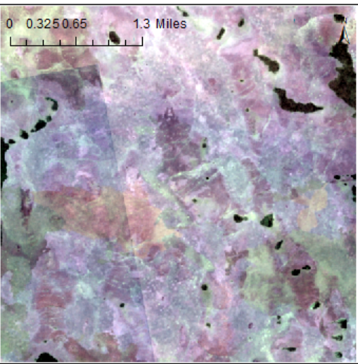
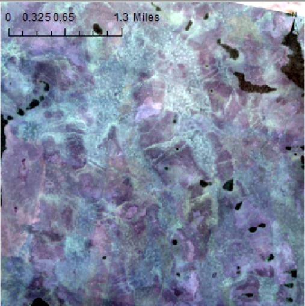

## Background and Objective
-The project aims to identify croplands in Western Congo through machine learning techniques
- Areas of interest were identified by Cloud to Street and had seen severe flooding in the last few years
- An Active Learning Framework that currently exists for Ghana expanded for this region
---
## Methodology
- The project utilizes an AWS platform (EC2 for computing and S3 for storage) and crowdsourcing methods for training data collection

- The four major components of the process are:

    1) Image Acquisition and Pre-Processing
    
    2) Training data 
    
    3) Machine Learning
    
    4) Segmentation 


---
## Image acquisition
- Planet Imagery at a 3 to 4 meter resolution acquired for areas of interest
- Planet Scope Satellites are box satellites provide high temporal and spatial resolution for cropland identification
- Image acquired for two time frames:

     1) Off-Season or Dry season- Between December to February
     
     2) Growing Season or Wet Season- Between May to September

```{r, echo = FALSE, out.width="60%", fig.align='center'}
knitr::include_graphics(here::here("images/GS.png"))
```
 
 

  
---
## Training data collection
- 200 Training sites from the 0.005-degree grid randomly selected across study area 
- F-sites  were located 
The sites are then stored in postgres. 


Training site classfiers from the spatial collective in Africa access a OpenLayers.
The classifiers from the spatial collect work on creating training and validation data.


<!-- ```{r, echo=FALSE, out.width='95%', message = FALSE, warning = FALSE} -->
<!-- knitr::include_graphics(here::here("Desktop/EOsettlemnt.png")) -->
<!-- ``` -->


Settlement Locations (datafromHDX) and the buffer sights


---
## Machine learning/ (Future)
In this stage the human / machine and machine connection is established.
A "custom crowdsourcing platfrom" is created.

This platfrom is called labeller wich is built around human assessors that complete tasks, includes building data for understanding accuracy and data training.
Mapper is established for classfication, which uses a random forest algorithm. In this case, it has 80 trees.

---
## Conclusion
The final two steps are the active feedback loop and segmentation.
This segmentation (field segmentation) step is powered by a meanshift algorithm (Yizong Cheng, 1995) and followed up by a accuracy assessment.
The challange of creating a automated system for cropland segmentaion in heavily forested and remote areas.
Requires care towards accuarcy and limiting factors.
    


---
# Thank you
Lyndon, Su and Lei

