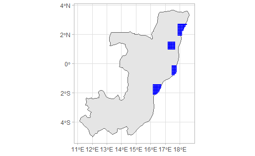

```{r setup, include = FALSE}
knitr::opts_chunk$set(
  collapse = TRUE,
  comment = "#>"
)
library(knitr)
```

## Summary
The purpose of this project is to gain an understanding and hands-on experience of cropland classification using an active learning framework. We seek to extend the existing active learning framework developed for identifying croplands in Ghana to the Congo region. Four areas of interest _(Fig 1)_ that have recently experienced flooding were dentified by Cloud to Street for cropland detection.

```{r, fig.align='center', echo=FALSE}

```
<center>
_Fig 1: AOIs in Congo_
</center>

## Methodology
There are four major components for the project:

1. Image Acquisition and Pre-Processing 
2. Training Data
3. Machine Learning
4. Segmentation

Before diving into the mapping components, a server platform is required for data storage and computer processing purposes. In this project, the computer is powered by Amazon Web Services (AWS). EC2 instances are used for computation, while S3 is used for storage.  Since this active learning framework requires script running, we install the AWS Command Line Interface (CLI) to connect programming software with AWS. Github is another core platform used in this project which possesses the script storage location and repository management tool. The repositories we used for this project were imager and labeler.


## Image acquisition 
All the Congo imageries of interest are extracted from PlanetScope, which yields 3-meter resolution imageries, with a daily return and four bands (R, G, B, and NIR). Planet provides high temporal(daily) and spatial resolution (3 to 4 meters), allowing the reduction of cloudy areas by filtering all of the values and therefore retrieving high-quality growing and off-season imageries. (Debats et al. 2016, Defourny et al. 2019). The imagery is broken up into the dry season (December-February) and the entire wet season (May - September) extended due to cloudiness. The images are tiled into 0.05-degree cells, and the purpose of the composting process is to create an "analysis-ready data" (ARD) product (Dwyer et al., 2018). The procedure outputs the composites to an S3 bucket. One of the challenges that occurred in this step included cloudy imagery requiring further inspection between impacted AOIs. In figure 2, (below) the Planet Scope Congo imagery for both growing season and off season is displayed.
  
```{r, echo=FALSE, fig.align='center'}
knitr::include_graphics(c("images/imagery.PNG"))
```
<center>
_Fig 2: Off Season Imagery (Top left) | Growing season Imagery (Bottom Left) | Tile Location in Study Area	(Right)_
</center>


## Defining Training Sites
Before the mapping process is initiated, training sites in the study area must be defined. Two hundred f-sites from the 0.005-degree grid were selected randomly across the four areas of interest in the Congo. The sites are stored in a Postgres table that will later be used by workers to digitize crop fields visible around the site. However, upon closer visual inspection, we noticed that many sites were located in remote forest areas or flood plain zones _(Fig 3)_ away from settlements. Training sites where croplands are not visible limits the amount of training data that can be used in the feature extraction process.
```{r, echo=FALSE, fig.align='center'}
knitr::include_graphics(c("images/examples.PNG"))
```
<center>
_Fig 3: F-Site in a Remote Forest Area (Left) | F-Site in a Flood Plain Zone (Right)_
</center>
  
Settlement data from Facebook's High-Resolution Population Density Maps for Congo was incorporated to increase the likelihood of finding croplands around f-sites. Settlements were cropped to the AOI in Congo (Fig 3), and distance to the nearest settlement were calculated for each f-site. From a visual analysis, we determined that f-sites within 1500 meters of a settlement had the highest likelihood of being located around croplands. However, only 47 f-sites in our database met those criteria. For example, f-site in figure 4 is located 148 meters away from the nearest settlement, and deforested patches can be seen. Within the white cell are most likely crop fields, which is shown within the red circle. The purpose of this was to better understand, for ourselves, what crop fields look like from a basemap and therefore facilitates the process of letting workers identify cropland better in Congo. From this process, we conclude that f-sites must be regenerated to be closer to settlements for better training data.
  
```{r, echo=FALSE, fig.align='center'}
knitr::include_graphics(c("images/cropland_cropped.PNG"))
```
<center>
_Fig. 4: An illustration of cropland in Congo_
</center>

## Future Work: Training
The training process will be performed using EC2 runs on Linux Virtual Machine, an OpenLayer3 mapping interface, Raster Foundry image server and a set of utilities managing, converting assignments to rasterized labels for the machine learning process. Registered workers can navigate to the Openlayers mapping interfaces and select a cell that is chosen randomly, then they start digitizing with a set of tools and different image backups, including false and true color composites for both off and growing seasons from PlanetScope imageries. Once a worker completes digitizing a grid cell, it will be saved into the server, and then that worker can choose to digitize a new assignment. Once a full set of sites is classified completely, they are randomly partitioned into training and validation sets. 
```{r, echo=FALSE, fig.align='center'}
knitr::include_graphics(c("images/mappingplatform.PNG"))
```
<center>
_Fig. 5: The test and portal for the training site team_
</center>

_Figure 5_ shows an instance of a mapping qualification test for a worker before joining the mapping team. A worker needs to digitize the polygon of a crop field, if there is any, and label the digitized polygon as cropland. 

## Future Work: Machine learning 
Before running the machine learning process, we will extract additional features from growing and off-season from PlanetScope, and those other features include reflectance values and vegetation indices, which are valuable for cropland classification. The collective subsets of PlanetScope imageries derive the blue, green, red, and near-infrared bands, mean and standard deviation of vegetation indices, and then convert those into RasterFrames, which makes it suitable for raster data.                                                    
    Once the features from the training sites are extracted into RasterFrames, the classification process can begin. Features are combined with their corresponding labels and passed to the machine learning classifier, with the RandomForest classification.                    
  The active learning process is initiated after fitting and model evaluation. The process serves its purposes as QA/QC by calculating the posterior probability of cropland presence and an uncertainty criterion. For the grid cell that has the highest value uncertainty criterion, that grid cell will be sent back to the mapper for workers to re-digitize new labels. The iteration of the launching of the machine learning cluster, reassessment of uncertainty criterion for the most uncertain sites, and relabelling of those sites continue until the map accuracy metrics remain constant.      

## Conclusion
Although we did not complete the whole Congo mapping project, we managed to grasp the fundamental principles and understanding of active learning. However, there were some hurdles we encountered in this project, such as accessing Amazon S3, 800 missing scenes, and an abundance of cloudy images. All of those obstacles caused a significant delay in the timeline of project completion, especially the missing and cloudy imageries, because we had to rerun the image composition to get less cloudy imagery and fill in those 800 missing scenes. 
As for future work, we hope to have more time to work on this project and build a more extensive understanding of the dynamics in the final steps. Upon completion of the project, vital information for disaster recovery and planning purposes will be available to Congolese people in the form of cropland data. 

## Work Cited :
- Defourny, P., S. Bontemps, N. Bellemans, C. Cara, G. Dedieu, E. Guzzonato, O. Hagolle, J. Inglada, L. 481 Nicola, T. Rabaute, M. Savinaud, C. Udroiu, S. Valero, A. Bégué, J.-F. Dejoux, A. El Harti, J. 482 Ezzahar, N. Kussul, K. Labbassi, V. Lebourgeois, Z. Miao, T. Newby, A. Nyamugama, N. Salh, A. 483 Shelestov, V. Simonneaux, P. S. Traore, S. S. Traore, and B. Koetz. 2019. Near real-time agriculture 484 monitoring at national scale at parcel resolution: Performance assessment of the Sen2-Agri automated 485 system in various cropping systems around the world. Remote Sensing of Environment 221:551–568.
- Dwyer, J. L., D. P. Roy, B. Sauer, C. B. Jenkerson, H. K. Zhang, and L. Lymburner. 2018. Analysis 491 Ready Data: Enabling Analysis of the Landsat Archive. Remote Sensing 10:1363. 
- Estes, L., Ye, S., Song , L., Eastman, R., & Avery, R. (n.d.). Improving cropland maps through the integration of human and machine intelligence. Improving cropland maps through the integration of human and machine intelligence. Worcester.

