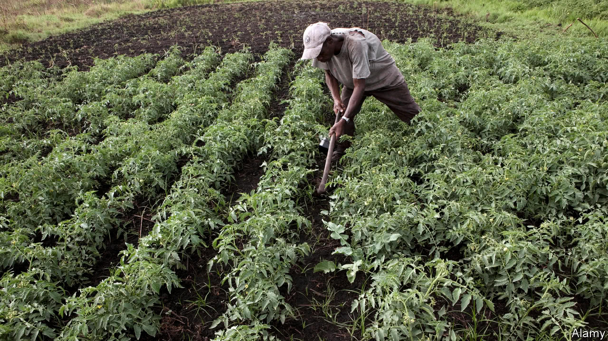
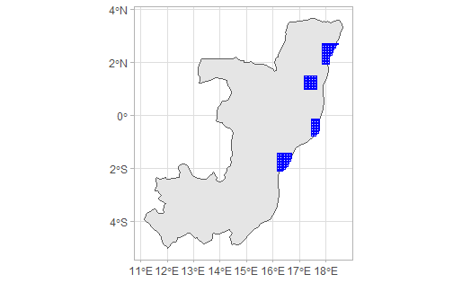
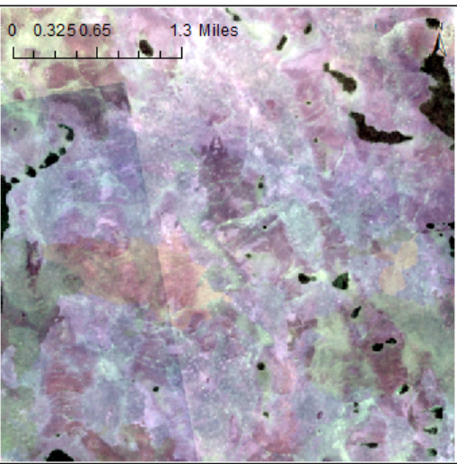
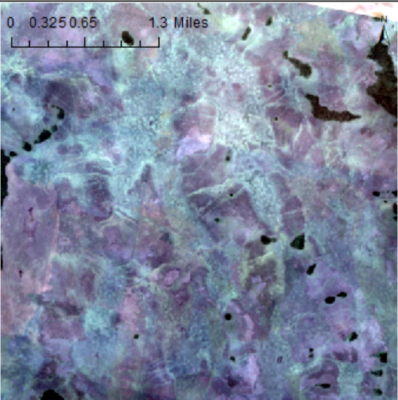
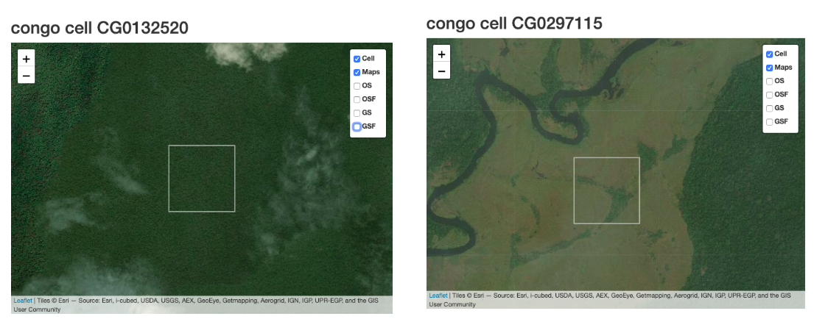
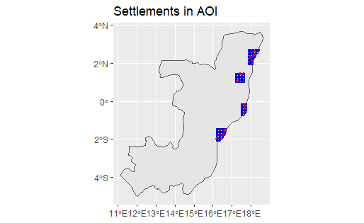
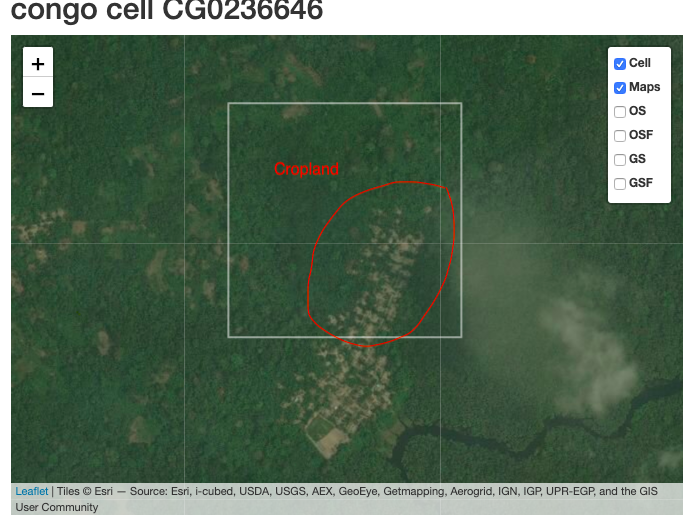

```{r setup, include=FALSE}
knitr::opts_chunk$set(echo = FALSE)
library(here)
```

<center>

</center>

## Background and Objective
- The project aims to identify croplands in Western Congo through machine learning techniques
- Areas of interest were identified by Cloud to Street 
- Croplands in these areas fall along major rivers that had seen severe flooding in the recent years
- An Active Learning Framework that currently exists for Ghana expanded for this region

## Study Area
<center>

</center>

## Methodology
- The project utilizes an AWS platform (EC2 for computing and S3 for storage) and crowdsourcing methods for training data collection

- The four major components of the process are:

    1) Image Acquisition and Pre-Processing
    
    2) Training data 
    
    3) Active Learning Framework
    
    4) Segmentation

## Image acquisition
- Planet Imagery at a 3 to 4 meter resolution acquired for areas of interest
- Planet Scope Satellites are box satellites provide high temporal and spatial resolution for cropland identification
- Image acquired for two time frames:

     1. _Off-Season or Dry Season_- Between December to February
     2. _Growing Season or Wet Season_- Between May to September
     
## Growing Season Tile
<center>

</center>

## Off Season Tile
<center>

</center>

## Training Data Selection
- 200 Training sites from the 0.005-degree grid randomly selected across the study area 
- Most f-sites were located in remote forest areas or in flood plain zones
<center>

</center>

## Settlements
- Settlements from Facebook's High-Resolution Population Density Maps for Congo used to determine proximity to settlements for each f-site
- Only 47 out of 200 existing f-sites located within 1500 meters of settlements
<center>

</center>

## Croplands in Congo 
- Digitizing rules similar to the one seen below are provided to workers
<center>

</center>

## Training Data Collection 
- Registered workers begin the process of digitizing within f-sites through a crowdsourcing platform 
- Consensus label generated by weighing the average accuracy of each worker's assignments to date

## Future Work: Machine learning 
- Extract additional features, such as RGB and NIR bands, then convert them into RasterFrames
- Run a Random Forest classification
- The repetition of feature extraction, for the rest of mapping geography
- The fitted model: calculate the posterior probability of cropland presence and uncertainty criterion

## Conclusion
- The final two steps are the active feedback loop and segmentation.
- This segmentation (field segmentation) step is powered by a meanshift algorithm (Yizong Cheng, 1995) and followed up by an accuracy assessment.
- The challenge of creating an automated system for cropland segmentation in heavily forested and remote areas.
- Care towards accuracy and limiting factors required
    
## Thank you
Lyndon, Su and Lei


